# dbplot 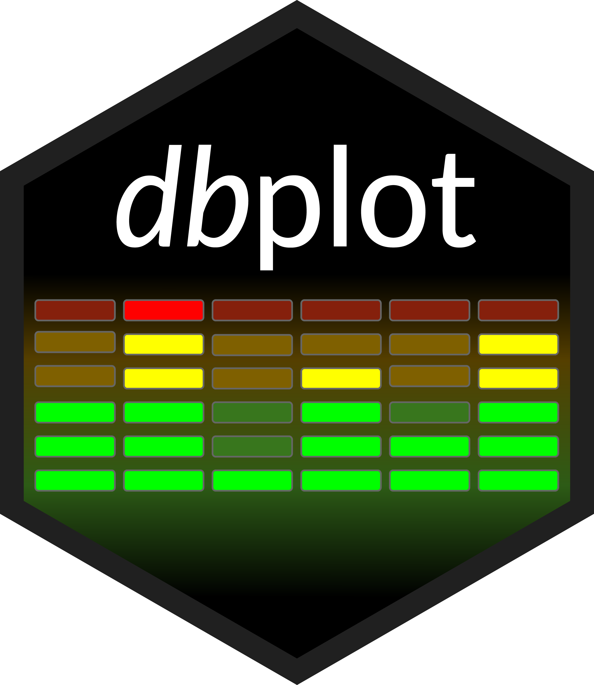

[](https://github.com/edgararuiz/dbplot/actions/workflows/R-CMD-check.yaml)
[](https://CRAN.R-project.org/package=dbplot)
[](https://app.codecov.io/github/edgararuiz/dbplot?branch=main)

- [Installation](#installation)
- [Connecting to a data source](#connecting-to-a-data-source)
- [Example](#example)
- [`ggplot`](#ggplot)
  - [Histogram](#histogram)
  - [Raster](#raster)
  - [Bar Plot](#bar-plot)
  - [Line plot](#line-plot)
  - [Boxplot](#boxplot)
- [Calculation functions](#calculation-functions)
- [`db_bin()`](#db_bin)

Leverages `dplyr` to process the calculations of a plot inside a
database. This package provides helper functions that abstract the work
at three levels:

1.  Functions that output a `ggplot2` object
2.  Functions that output a `data.frame` object with the calculations
3.  Functions that create formulas for calculating bins for a Histogram
    or a Raster plot

## Installation

You can install the released version from CRAN:

``` r
install.packages("dbplot")
```

Or the development version from GitHub, using the `remotes` package:

``` r
install.packages("remotes")
pak::pak("edgararuiz/dbplot")
```

## Connecting to a data source

- For more information on how to connect to databases, including Hive,
  please visit <https://solutions.posit.co/connections/db/>

- To use Spark, please visit the `sparklyr` official website:
  <https://spark.posit.co>

## Example

The functions work with standard database connections (via DBI/dbplyr)
and with Spark connections (via sparklyr). A local DuckDB database will
be used for the examples in this README.

``` r
library(DBI)
library(dplyr)

con <- dbConnect(duckdb::duckdb(), ":memory:")
db_flights <- copy_to(con, nycflights13::flights, "flights")
```

## `ggplot`

### Histogram

By default `dbplot_histogram()` creates a 30 bin histogram

``` r
library(ggplot2)

db_flights |>
  dbplot_histogram(distance)
```

<div class="figure">

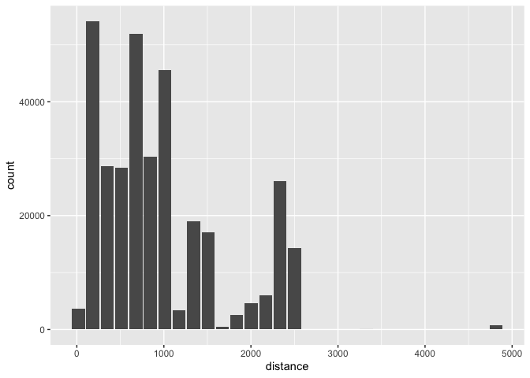
<p class="caption">

Histogram of flight distances with default 30 bins
</p>

</div>

Use `binwidth` to fix the bin size

``` r
db_flights |>
  dbplot_histogram(distance, binwidth = 400)
```

<div class="figure">

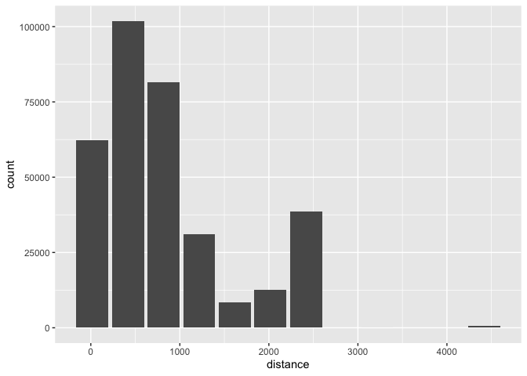
<p class="caption">

Histogram of flight distances with 400-unit bins
</p>

</div>

Because it outputs a `ggplot2` object, more customization can be done

``` r
db_flights |>
  dbplot_histogram(distance, binwidth = 400) +
  labs(title = "Flights - Distance traveled") +
  theme_bw()
```

<div class="figure">

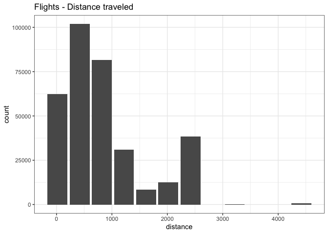
<p class="caption">

Customized histogram with title and theme
</p>

</div>

### Raster

To visualize two continuous variables, we typically resort to a Scatter
plot. However, this may not be practical when visualizing millions or
billions of dots representing the intersections of the two variables. A
Raster plot may be a better option, because it concentrates the
intersections into squares that are easier to parse visually.

A Raster plot basically does the same as a Histogram. It takes two
continuous variables and creates discrete 2-dimensional bins represented
as squares in the plot. It then determines either the number of rows
inside each square or processes some aggregation, like an average.

- If no `fill` argument is passed, the default calculation will be
  count, `n()`

``` r
db_flights |>
  dbplot_raster(sched_dep_time, sched_arr_time)
```

<div class="figure">

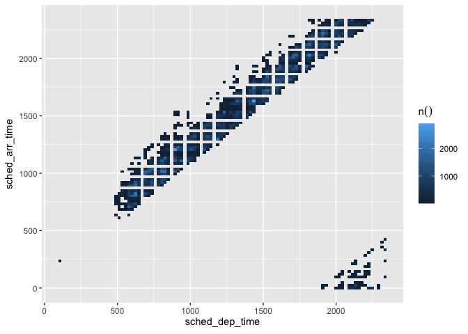
<p class="caption">

Raster plot of scheduled departure and arrival times
</p>

</div>

- Pass an aggregation formula that can run inside the database

``` r
db_flights |>
  dbplot_raster(
    sched_dep_time,
    sched_arr_time,
    mean(distance, na.rm = TRUE)
    )
```

<div class="figure">

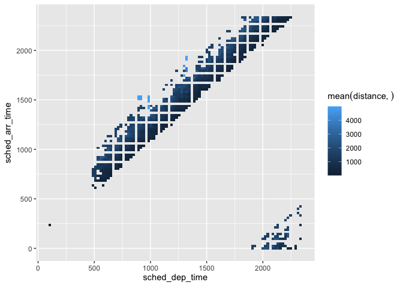
<p class="caption">

Raster plot showing average flight distance by time
</p>

</div>

- Increase or decrease for more, or less, definition. The `resolution`
  argument controls that, it defaults to 100

``` r
db_flights |>
  dbplot_raster(
    sched_dep_time,
    sched_arr_time,
    mean(distance, na.rm = TRUE),
    resolution = 20
    )
```

<div class="figure">

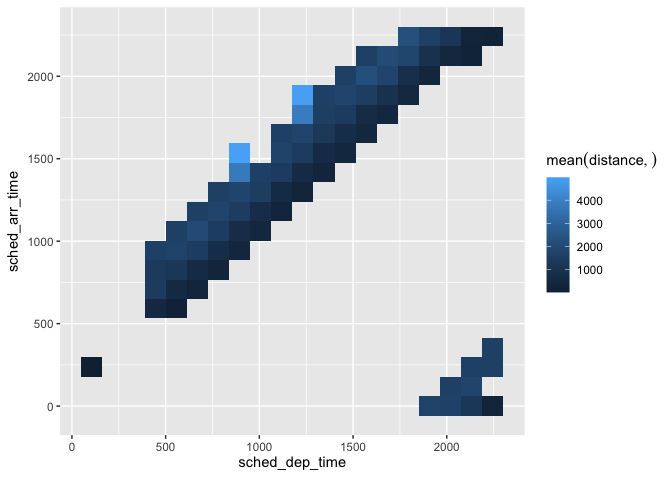
<p class="caption">

Raster plot with lower resolution (20x20 grid)
</p>

</div>

### Bar Plot

- `dbplot_bar()` defaults to a count() of each value in a discrete
  variable

``` r
db_flights |>
  dbplot_bar(origin)
```

<div class="figure">

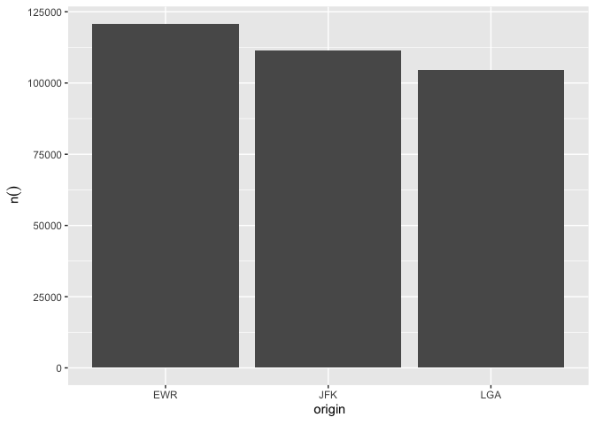
<p class="caption">

Bar plot of flight counts by origin airport
</p>

</div>

- Pass an aggregation formula that will be calculated for each value in
  the discrete variable

``` r
db_flights |>
  dbplot_bar(origin, avg_delay =  mean(dep_delay, na.rm = TRUE))
```

<div class="figure">

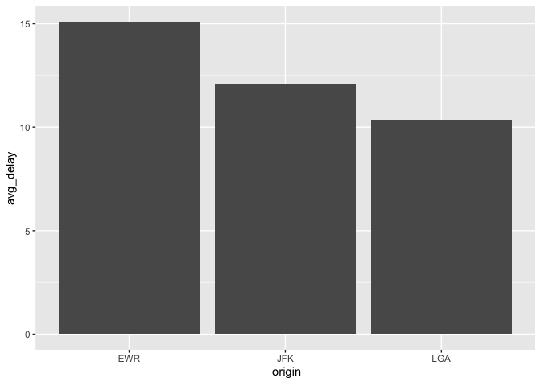
<p class="caption">

Bar plot of average departure delay by origin airport
</p>

</div>

### Line plot

- `dbplot_line()` defaults to a count() of each value in a discrete
  variable

``` r
db_flights |>
  dbplot_line(month)
```

<div class="figure">

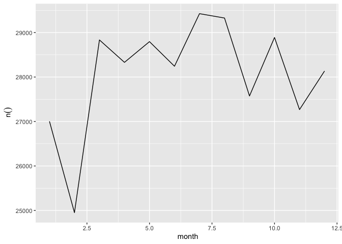
<p class="caption">

Line plot of flight counts by month
</p>

</div>

- Pass a formula that will be operated for each value in the discrete
  variable

``` r
db_flights |>
  dbplot_line(month, avg_delay = mean(dep_delay, na.rm = TRUE))
```

<div class="figure">

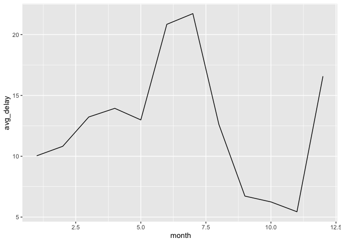
<p class="caption">

Line plot of average departure delay by month
</p>

</div>

### Boxplot

It expects a discrete variable to group by, and a continuous variable to
calculate the percentiles and IQR. It doesn’t calculate outliers.

Boxplot functions require database support for percentile/quantile
calculations.

**Supported databases:**

- DuckDB (recommended for local examples) - uses `quantile()`
- Spark/Hive (via sparklyr) - uses `percentile_approx()`
- SQL Server (2012+) - uses `PERCENTILE_CONT()`
- PostgreSQL (9.4+) - uses `percentile_cont()`
- Oracle (9i+) - uses `PERCENTILE_CONT()`

**Not supported:** SQLite, MySQL \< 8.0, MariaDB (no percentile
functions)

Here is an example using `dbplot_boxplot()` with a local data frame:

``` r
nycflights13::flights |>
  dbplot_boxplot(origin, distance)
```

<div class="figure">


<p class="caption">

Boxplot of flight distances by origin airport (local data)
</p>

</div>

Boxplot also works with database connections that support quantile
functions:

``` r
db_flights |>
  dbplot_boxplot(origin, distance)
```

<div class="figure">

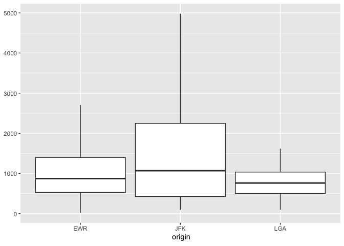
<p class="caption">

Boxplot of flight distances by origin airport (DuckDB)
</p>

</div>

## Calculation functions

If a more customized plot is needed, the data the underpins the plots
can also be accessed:

1.  `db_compute_bins()` - Returns a data frame with the bins and count
    per bin
2.  `db_compute_count()` - Returns a data frame with the count per
    discrete value
3.  `db_compute_raster()` - Returns a data frame with the results per
    x/y intersection
4.  `db_compute_raster2()` - Returns same as `db_compute_raster()`
    function plus the coordinates of the x/y boxes
5.  `db_compute_boxplot()` - Returns a data frame with boxplot
    calculations

``` r
db_flights |>
  db_compute_bins(arr_delay) 
#> # A tibble: 28 × 2
#>    arr_delay  count
#>        <dbl>  <dbl>
#>  1      95.1   7890
#>  2     321.     232
#>  3     729.       5
#>  4     548.       6
#>  5     684.       1
#>  6     -40.7 207999
#>  7      NA     9430
#>  8     276.     425
#>  9     457.      23
#> 10     593        6
#> # ℹ 18 more rows
```

The data can be piped to a plot

``` r
db_flights |>
  filter(arr_delay < 100 , arr_delay > -50) |>
  db_compute_bins(arr_delay) |>
  ggplot() +
  geom_col(aes(arr_delay, count, fill = count))
```

<div class="figure">

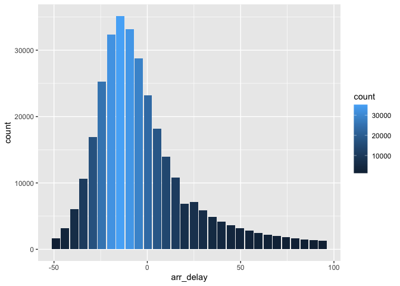
<p class="caption">

Custom histogram of arrival delays using db_compute_bins
</p>

</div>

## `db_bin()`

Uses ‘rlang’ to build the formula needed to create the bins of a numeric
variable in an un-evaluated fashion. This way, the formula can be then
passed inside a dplyr verb.

``` r
db_bin(var)
#> (((max(var, na.rm = TRUE) - min(var, na.rm = TRUE))/30) * ifelse(as.integer(floor((var - 
#>     min(var, na.rm = TRUE))/((max(var, na.rm = TRUE) - min(var, 
#>     na.rm = TRUE))/30))) == 30, as.integer(floor((var - min(var, 
#>     na.rm = TRUE))/((max(var, na.rm = TRUE) - min(var, na.rm = TRUE))/30))) - 
#>     1, as.integer(floor((var - min(var, na.rm = TRUE))/((max(var, 
#>     na.rm = TRUE) - min(var, na.rm = TRUE))/30))))) + min(var, 
#>     na.rm = TRUE)
```

``` r
db_flights |>
  group_by(x = !! db_bin(arr_delay)) |>
  count()
#> # Source:   SQL [?? x 2]
#> # Database: DuckDB 1.4.4 [edgar@Darwin 25.3.0:R 4.5.2/:memory:]
#> # Groups:   x
#>         x      n
#>     <dbl>  <dbl>
#>  1 -40.7  207999
#>  2  NA      9430
#>  3 276.      425
#>  4 457.       23
#>  5 593         6
#>  6   4.53  79784
#>  7 186.     1742
#>  8  95.1    7890
#>  9 321.      232
#> 10 729.        5
#> # ℹ more rows
```

``` r
db_flights |>
  filter(!is.na(arr_delay)) |>
  group_by(x = !! db_bin(arr_delay)) |>
  count()|>
  collect() |>
  ggplot() +
  geom_col(aes(x, n))
```

<div class="figure">

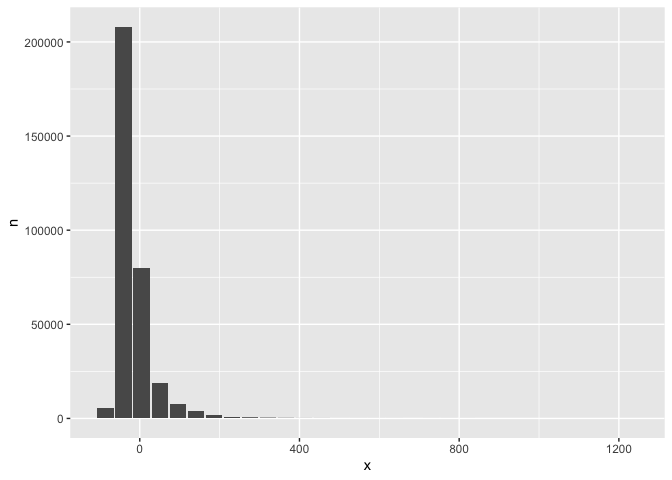
<p class="caption">

Custom histogram of arrival delays using db_bin
</p>

</div>

``` r
dbDisconnect(con)
```
